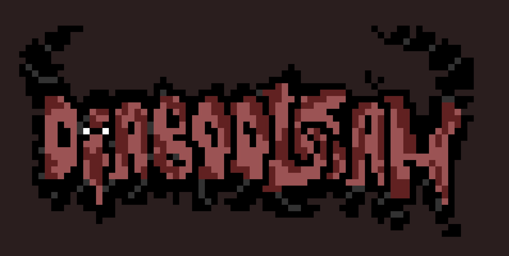

# 👹 Diaboolean



---

## 📜 Descrição

Aventure-se nas profundezas de Diaboolean, uma masmorra corrompida onde a própria verdade está sob ataque. Salas ancestrais barram seu caminho, guardadas não por bestas, mas por "Chefes" que manipulam a realidade. Para sobreviver, você deve usar valores lógicos para forjar a "chave" correta, tudo isso enquanto os inimigos ativamente contrariam sua lógica, tentando te prender para sempre na escuridão.

---

## 🚀 Instruções para Compilar e Executar

### Requerimentos
- Linux, Mac ou WSL
- Compilador (gcc) ou Make

```shell

# usando compilador
gcc $(find src -name '*.c') -I include/ -o build/main && ./build/main

# or

# usando Make
make run
```

---

## 🎮 Regras e Como Jogar

### Modos
- salas normais, onde o personagem lê avisos e vai até a porta da próxima fase
- salas de batalha, onde o personagem pecorre uma grid definindo valores lógicos: J (none), K (true), L (false), enquanto um inimigo redefine os valores já colocados e ataca o personagem.

### Como vencer?
Use os valores lógicos juntos dos simbolos para corresponder ao valor lógico de conclusão nas bordas da grid, assim validandos as premissas e ganhando a fase.

---

## 🎓 Informações Acadêmicas

* **Disciplina:** Programação Imperativa e Funcional - 2025.2
* **Instituição de Ensino:** CESAR School

### 👥 Equipe

* Iza Malafaia - @Iza-Malafaia
* Joanna Luciana - @Joanna-Farias
* Juliana Camparoto - @comparoto
* Marcos Antônio - @MarcosFraga0
* Maria Luiza - @alumiria
* Matheus de Freitas - @matheusprojects
* Vinicius Gabriel - @gitviini
